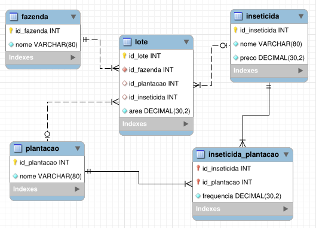

### Questão 1

Liste as entidades deste problema e seus atributos, usando a notação de schema do modelo relacional.

- Fazenda(_id_fazenda_, nome)
- Lote(_id_lote_, _id_fazenda_, id_plantacao, id_inseticida, area)
- Platacao(_id_platacao_, nome)
- Inseticida(_id_inseticida_, nome, preco)
- Inseticida_Plantacao(_id_inseticida_, _id_platacao_, frequencia)

### Questão 2

Desenhe o diagrama do modelo relacional deste problema. Não esqueça de indicar claramente as chaves primárias, chaves estrangeiras, e a cardinalidade dos relacionamentos.



### Questão 3

Escreva o script de criação da tabela referentes aos lotes.

```sql
CREATE TABLE Lote (
  id_lote INT UNSIGNED NOT NULL AUTO_INCREMENT,
  id_fazenda INT UNSIGNED NOT NULL,
  id_plantacao INT UNSIGNED NOT NULL,
  id_inseticida INT UNSIGNED NOT NULL,
  area DECIMAL(30 , 2) NOT NULL,
  PRIMARY KEY (id_lote, id_fazenda),
  KEY fk_id_fazenda (id_fazenda),
  KEY fk_id_plantacao (id_plantacao),
  KEY fk_id_inseticida (id_inseticida),
  CONSTRAINT `fk_id_fazenda` FOREIGN KEY (id_fazenda) REFERENCES Fazenda (id_fazenda) ON DELETE RESTRICT ON UPDATE CASCADE,
  CONSTRAINT `fk_id_plantacao` FOREIGN KEY (id_plantacao) REFERENCES Plantacao (id_plantacao) ON DELETE RESTRICT ON UPDATE CASCADE,
  CONSTRAINT `fk_id_inseticida` FOREIGN KEY (id_inseticida) REFERENCES Inseticida (country_id) ON DELETE RESTRICT ON UPDATE CASCADE
) ENGINE=InnoDB DEFAULT CHARSET=utf8mb4;
```

### Questão 4

Escreva a DML para as seguintes tarefas:

- **a.** Crie 3 lotes para a fazenda: um de 4 hectares, outro de 3 hectares, e outro de 5 hectares.

```sql
INSERT INTO lote (id_fazenda, id_plantacao, id_inseticida, area) VALUES (1, 1, 1, 3);
INSERT INTO lote (id_fazenda, id_plantacao, id_inseticida, area) VALUES (1, 2, 1, 4);
INSERT INTO lote (id_fazenda, id_plantacao, id_inseticida, area) VALUES (1, 3, 1, 5);
```

- **b.** Corrija um erro no item anterior: mude o tamanho do lote de 3 hectares para 3,5 hectares.

```sql
UPDATE lote SET area = 3.5 WHERE id_lote = 1 AND id_fazenda = 1;
```

- **c.** Como obter o id do lote em uma aplicação real? É realista pedir ao usuário que decore o id de cada lote?

Não é realista pedir que o usuário decore o `id` de cada lote. O correto seria ter uma interface que facilite esse processo para o usuário.

### Questão 5

Escreva queries para as seguintes tarefas:
- **a.** Qual a maior fazenda?

```sql
SELECT
    lote.id_fazenda, SUM(area) as total
FROM
    lote
GROUP BY
    id_fazenda
ORDER BY
    total DESC
LIMIT 1;
```

- **b.** Quais as plantações com área total maior que 10 hectares?

```sql
SELECT
    lote.id_plantacao, SUM(lote.area) as total
FROM
    lote
    INNER JOIN plantacao USING (id_plantacao)
GROUP BY
    lote.id_plantacao
ORDER BY
    total DESC
HAVING
    total >= 10
```

- **c.** Qual o custo total atual com inseticidas?

```sql
SELECT
    SUM(inseticida.preco * lote.area * inseticida_plantacao.frequencia)
FROM
    lote
    INNER JOIN inseticida USING (id_inseticida)
    INNER JOIN inseticida_plantacao USING (id_inseticida, id_plantacao)
```

- **d.** Quais inseticidas não foram usados?

```sql
SELECT
    inseticida.id_inseticida
FROM
    inseticida
WHERE
    inseticida.id_inseticida NOT IN (SELECT id_inseticida FROM lote)
```

- **e.** Qual o menor custo possível com inseticidas?

```sql
SELECT
    SUM(lote.area * tab_min.custo_mensal)
FROM
    lote
    INNER JOIN (
        SELECT id_plantacao, MIN(plantacao_inseticida.frequencia * inseticida.custo) AS custo_mensal
        FROM
            inseticida
            INNER JOIN plantacao_inseticida USING (id_inseticida)
        GROUP BY 
            id_plantacao
        ) AS tab_min USING (id_plantacao);
```
_OBS: Zero consegui fazer, ver o PDF de soluções._

- **f.** Escreva a query mais cruel que você consegue imaginar!
