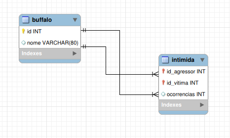
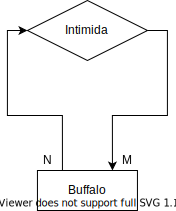

## Prova intermediária

### Questão 1

__a) [1,0 ponto] Desenhe o diagrama do modelo relacional representado por essa DDL. Você pode usar o draw.io para  fazer  esse  desenho,  o  MySQL  Workbenchou  a  ferramenta  de  sua  escolha,  contanto  que  o  diagrama saia  correto  e  que  você  consiga  gerar  uma  imagem  PNG. Não utilize o “reverse engineering” do MySQL Workbench. Grave seu diagrama no formato PNG e envie no Blackboard.__

__b) [0,5 ponto] Desenhe o diagrama do modelo entidade-relacionamento deste problema. Dica: relacionamento de uma entidade para a mesma entidade é permitido. Assim como no item (a), use a ferramenta de desenho de sua preferência, grave o resultado no formato PNG e mande para o Blackboard.__

__c) [0,5 ponto] O que acontece com o banco de dados como um todo quando um búfalo é deletado da tabela buffalo?__

Quando um buffalo é deletado, devido a configuração `ON DELETE CASCADE` na tabela de `intimida`, todas as linhas em que esse buffalo aparecia também serão deletadas.

__d) [1,0 ponto] Quantos búfalos agressores diferentes existem? (Dica: COUNT(DISTINCT blablabla)é diferente de DISTINCT COUNT(blablabla)).__

[Reposta questão 1D](./respostas/q1-d.sql)

__e) [1,0 ponto] Quais os búfalos que não agridem ninguém?__

[Reposta questão 1E](./respostas/q1-e.sql)

__f) [1,0 ponto] Qual o búfalo que mais sofreu intimidações?__

[Reposta questão 1F](./respostas/q1-f.sql)

__g) [1,5 pontos] Quais os búfalos que satisfazem as condições da frase curiosa do inicio da questão? Ou seja, quais os búfalos que intimidam outros búfalos e que também são intimidados por outros búfalos? (Dica: se ficar dificil fazer numa query só, use tabelas temporárias.)__

[Reposta questão 1G](./respostas/q1-g.sql)

### Questão 2
__a) [0,5 ponto] Qual a chave primária?__

| 1       | 2          | 3   | 4   |
| ------- | ---------- | --- | --- |
| A → C   | AB → ABCDE |     |     |
| B → BDE | AC → AC    |     |     |
| C → C   | AD → ACDE  |     |     |
| D → DE  | AE → ACE   |     |     |
|         |            |     |     |
|         |            |     |     |

A chave primária é AB.

__b) [1,0 ponto] Qual a forma normal desta relação? Justifique.__

Está relação está na apenas na primeira forma normal pois existem dependências parciais e transitivas.

__c) [1,0 ponto] Proponha uma normalização para a terceira forma normal.__

- Resposta correta:
    - X(A, C)
    - Y(B, D)
    - Z(D, E)
- Repostas erradas:
    - R(A, C)
    - S(B, D, E) - Está errado pois existe dependência transitiva de B -> D -> E.

### Questão 3

__a) [0,5 ponto] Qual a chave primária?__

A chave primaŕia é composta pelo CPF e o ano, ou seja, `(CPF, ano)`.

__b) [0,5 ponto] Seria adequado construir um indice para a coluna “renda anual”? Se sim, de qual tipo: hashtable ou b-tree?__

Sim, seria adequado criar um indice para a coluna "renda anual" pois esse campo tem alta demanda de busca. O tipo de indice mais adequado é o B-Tree pois ele é o melhor para buscas por faixa de valor.
